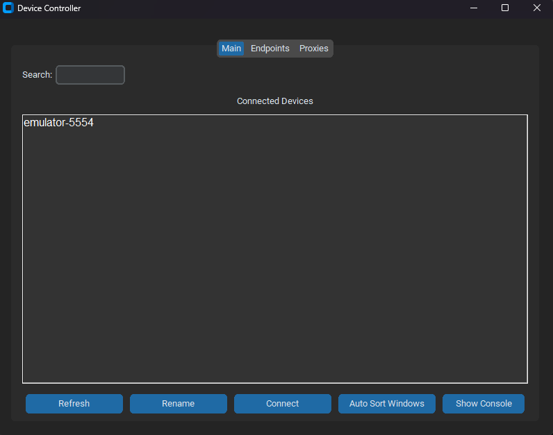

# Device Selector




This is a simple Python application built with Tkinter that allows you to view connected Android devices via ADB and control them using Scrcpy.

## Requirements

- Python 3.x
- ADB (Android Debug Bridge) installed and added to the system path
- Scrcpy installed (download from [here](https://github.com/Genymobile/scrcpy))

## Installation

1. Clone this repository:

    ```bash
    git clone https://github.com/BarisSenel/multi-adb-control.git
    ```

2. Install dependencies:

    ```bash
    pip install -r requirements.txt
    ```

3. Add ADB to the system path. If you haven't done so already, download ADB from the [Android Developers website](https://developer.android.com/studio/releases/platform-tools.html) and follow the instructions to add it to your system path.

4. Replace the `scrcpy_path` variable in the script (`control.py`) with the full path to the Scrcpy executable (`scrcpy.exe`).
## Tested Devices

Tested on Windows with 4 Android Phone.

## Usage

1. Run the application:

    ```bash
    python control.py
    ```

2. The application will display a list of connected devices. You can refresh the list, rename devices, connect to a device, and view debug information.

## License

This project is licensed under the MIT License - see the [LICENSE](LICENSE) file for details.
